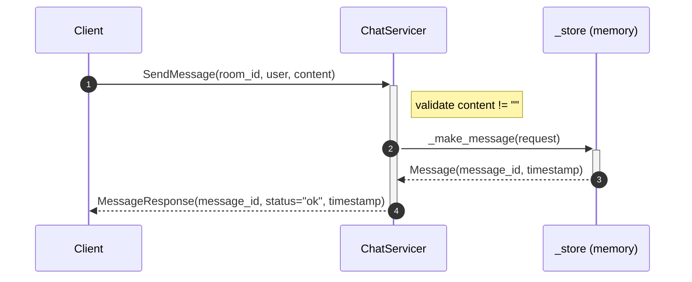
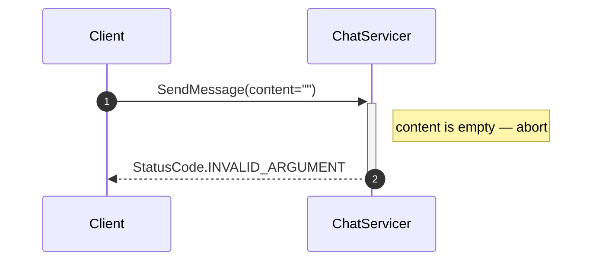
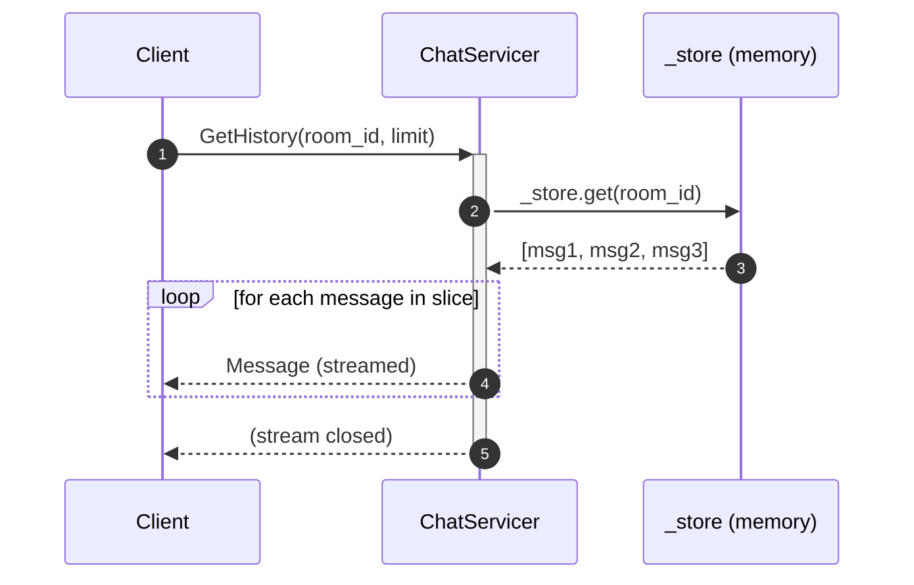
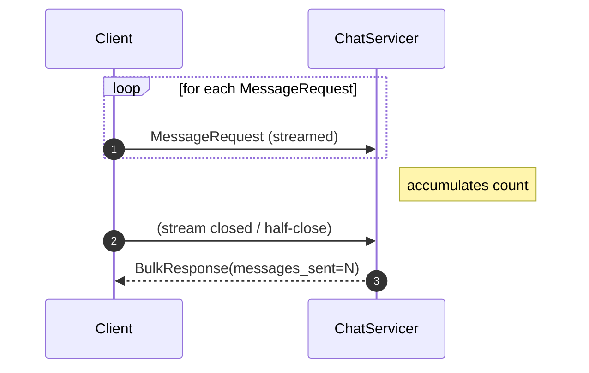
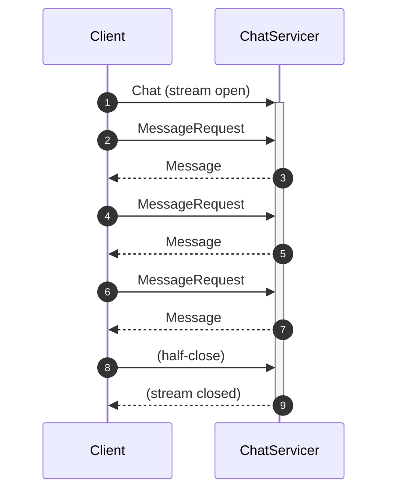
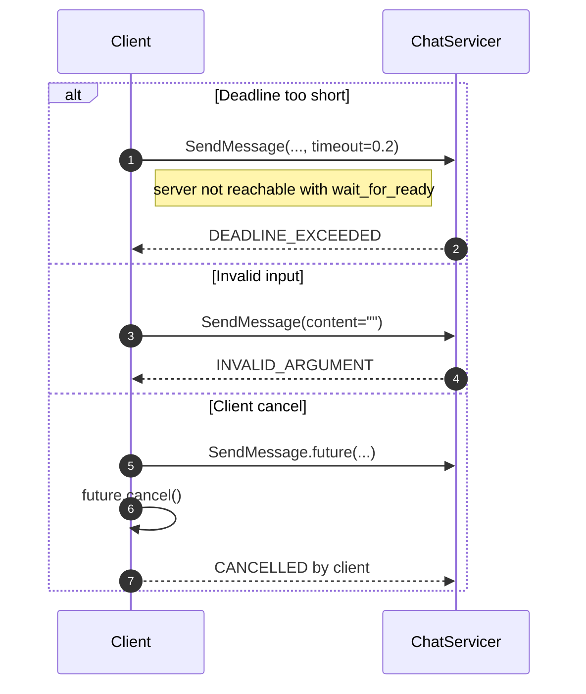
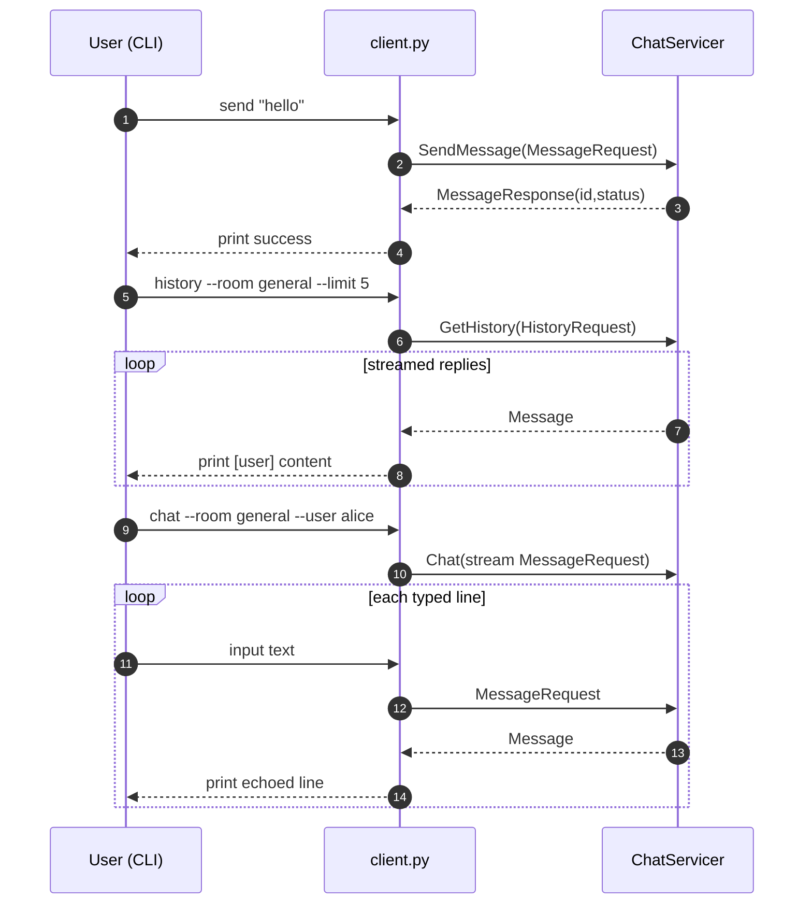

# How to prepare for the workshop

Install docker and docker-compose or install uv

You have three ways to run exercises:
1. **use docker** 
```bash
docker compose run --rm workshop <poe command>
```
2. **use uv**
```bash
uv run <poe command>
```

3. **use venv**
```bash
uv sync
source .venv/bin/activate
<poe command>
```
# Exercise 1: Proto Messages

## Goal

Define the remaining proto messages in `chat.proto`.
`MessageRequest` is already filled in as an example — study it, then define the rest.

## Example (already done)

```proto
message MessageRequest {
  string room_id = 1;
  string user    = 2;
  string content = 3;
}
```

## Your task

Define these four messages (field names and types are in the comments in the file):

| Message | Purpose |
|---------|---------|
| `MessageResponse` | returned after a successful `SendMessage` |
| `Message` | the stored chat message (returned by `GetHistory` / `Chat`) |
| `HistoryRequest` | request history for a room |
| `BulkResponse` | returned after a bulk upload |

## Verify

```bash
# From the workshop/ directory:
poe generate-exercises
# No errors → exercises/generated/ updated
```

## ✅ Micro-check

After `poe generate-exercises` you should see **no errors** on the terminal and
two new files in `exercises/generated/`:

```
exercises/generated/chat_pb2.py
exercises/generated/chat_pb2_grpc.py
```

If `protoc` prints `Field number 0 is illegal`, a field tag is missing.
If it prints `Expected field name`, a brace or semicolon is wrong.

## Solution

`solutions/01_protocol_buffers/chat.proto`


<details>

<summary>Click to view Solution 1</summary>

```proto

syntax = "proto3";

package chat;

service ChatService {
  rpc SendMessage(MessageRequest) returns (MessageResponse);
  rpc GetHistory(HistoryRequest) returns (stream Message);
  rpc SendBulkMessages(stream MessageRequest) returns (BulkResponse);
  rpc Chat(stream MessageRequest) returns (stream Message);
}

message MessageRequest {
  string room_id = 1;
  string user = 2;
  string content = 3;
}

message MessageResponse {
  string message_id = 1;
  string status = 2;
  int64 timestamp = 3;
}

message HistoryRequest {
  string room_id = 1;
  int32 limit = 2;
}

message BulkResponse {
  int32 messages_sent = 1;
  int32 messages_failed = 2;
}

message Message {
  string message_id = 1;
  string room_id = 2;
  string user = 3;
  string content = 4;
  int64 timestamp = 5;
}

```

</details>

# Exercise 2: Build a Service Stub 

## Goal

Add the `ChatServicer` method stubs — the Python object that will handle
incoming gRPC calls. In this exercise you only need the **structure** (no
logic yet).

## Context

After running `poe generate-exercises`, grpc_tools produced
`exercises/generated/chat_pb2_grpc.py`. Open it and find
`ChatServiceServicer` — this is the base class `ChatServicer` already
inherits from in `exercises/server.py`.

The generated base class defines these exact method signatures:

```python
def SendMessage(self, request, context):
	...

def GetHistory(self, request, context):
	...

def SendBulkMessages(self, request_iterator, context):
	...

def Chat(self, request_iterator, context):
	...
```

## Your task

Open `exercises/server.py` and, inside the `ChatServicer` class, add these
four methods (all return `pass` for now):

- `SendMessage(self, request, context)`
- `GetHistory(self, request, context)`
- `SendBulkMessages(self, request_iterator, context)`
- `Chat(self, request_iterator, context)`

The class already inherits from `chat_pb2_grpc.ChatServiceServicer`, and it's
already registered with the server in `serve()` — you only need to add the
method stubs.

## Run it

```bash
poe server
# gRPC server listening on :50051
# Ctrl-C to stop
```

The server starts but returns gRPC errors on every call — that's expected.
We'll add the real logic in Exercise 3.

## ✅ Micro-check

You should see exactly this line in the terminal:

```
gRPC server listening on :50051
```

If the server crashes on import, a method name is probably misspelled — check
against the signatures in the **Context** section above.
If it prints `unimplemented` when you call it, the stub is wired correctly —
that's the expected placeholder response from gRPC.

## Solution

`solutions/02_service_stub/server.py`


<details>

<summary>Click to view Solution 2</summary>

```python

"""Solution — Exercise 02: ChatServicer with four method stubs."""

import time
import uuid
from concurrent import futures

import grpc

from exercises.generated import chat_pb2, chat_pb2_grpc

_store: dict[str, list[chat_pb2.Message]] = {}


def _make_message(request: chat_pb2.MessageRequest) -> chat_pb2.Message:
    msg = chat_pb2.Message(
        message_id=str(uuid.uuid4()),
        room_id=request.room_id,
        user=request.user,
        content=request.content,
        timestamp=int(time.time()),
    )
    _store.setdefault(request.room_id, []).append(msg)
    return msg


class ChatServicer(chat_pb2_grpc.ChatServiceServicer):

    def SendMessage(self, request, context):
        pass

    def GetHistory(self, request, context):
        pass

    def SendBulkMessages(self, request_iterator, context):
        pass

    def Chat(self, request_iterator, context):
        pass


def serve(port: int = 50051) -> None:
    server = grpc.server(futures.ThreadPoolExecutor(max_workers=10))
    chat_pb2_grpc.add_ChatServiceServicer_to_server(ChatServicer(), server)
    server.add_insecure_port(f"[::]:{port}")
    server.start()
    print(f"gRPC server listening on :{port}")
    server.wait_for_termination()


if __name__ == "__main__":
    serve()

```

</details>

# Exercise 3: Implement Unary SendMessage

## Goal

Add real logic to `SendMessage` so the server actually stores and acknowledges
messages.

The helper `_make_message(request)` both stores the new message in memory and
returns the saved `Message` object, so you can reuse its generated
`message_id` and `timestamp` in the response.

## Context

A **unary RPC** works like a normal function call: one request in, one response
out. The servicer method receives:
- `request` — the `MessageRequest` proto object (fields: `room_id`, `user`, `content`)
- `context` — lets you set error codes, deadlines, metadata

## Message flow

**Happy path** — valid message stored and acknowledged:



**Error path** — empty content rejected before any persistence:



## Your task

Open `exercises/server.py` and implement `SendMessage` inside the
`ChatServicer` class:

1. **Validate first** — if `request.content` is empty, abort before any
   persistence happens:
    ```python
    context.abort(StatusCode.INVALID_ARGUMENT, "Message content cannot be empty")
    ```
2. **Save** — call `_make_message(request)`; it stores the message and
   returns a `Message` proto with `message_id` and `timestamp` already set
3. **Return** — a `MessageResponse`:
   ```python
   return chat_pb2.MessageResponse(
       message_id=msg.message_id,
       status="ok",
       timestamp=msg.timestamp,
   )
   ```

## Run it

```bash
# Terminal 1
poe server
# gRPC server listening on :50051

# Terminal 2 — quick smoke test with the CLI
poe client-send --room general --user alice "Hello!"
# ✓ Sent  id=<uuid>  status=ok
```

## ✅ Micro-check

Terminal 2 should print something like:

```
✓ Sent  id=3f2a1c7e-…  status=ok
```

Then try the failure path — an empty message should be rejected:

```bash
poe client-send --room general --user alice ""
# ✗ StatusCode.INVALID_ARGUMENT: Message content cannot be empty
```

If you get `UNIMPLEMENTED` instead of `INVALID_ARGUMENT`, `SendMessage` is
still returning `pass` — make sure the method is uncommented in `server.py`.

## Solution

`solutions/03_unary_service/server.py`


<details>

<summary>Click to view Solution 3</summary>

```python

"""Solution — Exercise 03: SendMessage implemented."""

import time
import uuid
from concurrent import futures

import grpc
from grpc import StatusCode

from exercises.generated import chat_pb2, chat_pb2_grpc

_store: dict[str, list[chat_pb2.Message]] = {}


def _make_message(request: chat_pb2.MessageRequest) -> chat_pb2.Message:
    msg = chat_pb2.Message(
        message_id=str(uuid.uuid4()),
        room_id=request.room_id,
        user=request.user,
        content=request.content,
        timestamp=int(time.time()),
    )
    _store.setdefault(request.room_id, []).append(msg)
    return msg


class ChatServicer(chat_pb2_grpc.ChatServiceServicer):

    def SendMessage(self, request, context):
        if not request.content.strip():
            context.abort(
                StatusCode.INVALID_ARGUMENT,
                "Message content cannot be empty",
            )
        msg = _make_message(request)
        return chat_pb2.MessageResponse(
            message_id=msg.message_id,
            status="ok",
            timestamp=msg.timestamp,
        )

    def GetHistory(self, request, context):
        pass

    def SendBulkMessages(self, request_iterator, context):
        pass

    def Chat(self, request_iterator, context):
        pass


def serve(port: int = 50051) -> None:
    server = grpc.server(futures.ThreadPoolExecutor(max_workers=10))
    chat_pb2_grpc.add_ChatServiceServicer_to_server(ChatServicer(), server)
    server.add_insecure_port(f"[::]:{port}")
    server.start()
    print(f"gRPC server listening on :{port}")
    server.wait_for_termination()


if __name__ == "__main__":
    serve()

```

</details>

# Exercise 4: Unary Client + Verify Communication

## Goal

Write a client that calls `SendMessage` and see both sides talk to each other.

## Context

A gRPC client needs two objects:
- **Channel** — the connection to the server (one per process, reuse it)
- **Stub** — the auto-generated proxy that exposes RPC methods as Python functions

```
channel = grpc.insecure_channel("localhost:50051")
stub    = chat_pb2_grpc.ChatServiceStub(channel)
```

## Your task

Open `client_starter.py` and fill in the TODOs:

1. Create an `insecure_channel` to `"localhost:50051"` using a context manager:
   ```python
   with grpc.insecure_channel("localhost:50051") as channel:
   ```
2. Create a `ChatServiceStub` from the channel
3. Call `stub.SendMessage(...)` with a `MessageRequest`
   (fields: `room_id`, `user`, `content`)
4. Print `response.message_id` and `response.status`
5. Add a `try/except grpc.RpcError` to handle errors gracefully

## Run it

```bash
# Terminal 1 — start the server from Exercise 3
poe server

# Terminal 2 — run your client
poe starter-04
# Expected output:
#   message_id: <uuid>
#   status:     ok
```

Try sending an empty message — what error code do you get?

## ✅ Micro-check

Your script should print two lines, for example:

```
message_id: 3f2a1c7e-…
status:     ok
```

If it raises `TypeError: insecure_channel() argument 1 must be str, not ellipsis`,
you still have a `...` placeholder — fill in the channel address string.
If it prints nothing and exits silently, the `except` block is swallowing the
error — add a `print` inside the `except` so you can see what went wrong.

## Solution

`solutions/04_unary_client/client.py`


<details>

<summary>Click to view Solution 4</summary>

```python

"""Solution — Exercise 04: completed unary gRPC client."""

import grpc

from exercises.generated import chat_pb2, chat_pb2_grpc


def main():
    with grpc.insecure_channel("localhost:50051") as channel:
        stub = chat_pb2_grpc.ChatServiceStub(channel)
        try:
            response = stub.SendMessage(
                chat_pb2.MessageRequest(
                    room_id="general",
                    user="alice",
                    content="Hello EuroPython!",
                )
            )
            print(f"message_id: {response.message_id}")
            print(f"status:     {response.status}")
        except grpc.RpcError as e:
            print(f"Error {e.code()}: {e.details()}")


if __name__ == "__main__":
    main()

```

</details>

# Exercise 5: Streaming Patterns 

## Goal

Extend the server with all four communication patterns and test each one from the client.

This exercise has two required parts and one bonus part:
- **Required:** server streaming and client streaming
- **Bonus:** bidirectional streaming (`Chat`)

## Prerequisites

Have your server running (`poe server`) so you can test the client side
independently while you iterate on the servicer methods below.

## Message flows

**Server streaming — `GetHistory`** (one request, many responses):



**Client streaming — `SendBulkMessages`** (many requests, one response):



**Bidirectional — `Chat`** (bonus — many requests, many responses interleaved):



## Required Tasks

### Task 1 — Server streaming: `GetHistory`

In `exercises/server.py`, inside `ChatServicer`, implement
`GetHistory(self, request, context)`:

```python
def GetHistory(self, request, context):
    messages = _store.get(request.room_id, [])
    limit = request.limit if request.limit > 0 else len(messages)
    for msg in messages[-limit:]:
        yield msg   # ← key: just yield, gRPC handles the stream
```

Client side — iterate the result like a generator:

```python
for message in stub.GetHistory(
    chat_pb2.HistoryRequest(room_id="general", limit=10)
):
    print(f"[{message.user}] {message.content}")
```

### Task 2 — Client streaming: `SendBulkMessages`

```python
def SendBulkMessages(self, request_iterator, context):
    sent = 0
    for request in request_iterator:   # ← iterate the stream
        _store.setdefault(request.room_id, []).append(...)
        sent += 1
    return chat_pb2.BulkResponse(messages_sent=sent, messages_failed=0)
```

Client side — pass a **generator** as the argument:

```python
def messages():
    for i in range(10):
        yield chat_pb2.MessageRequest(room_id="general", user="alice", content=f"bulk {i}")

response = stub.SendBulkMessages(messages())
print(f"Sent: {response.messages_sent}")
```

## Bonus Task

### Bidirectional streaming: `Chat`

This is optional if you’re short on time. Try it after the required tasks are
working.

```python
def Chat(self, request_iterator, context):
    for request in request_iterator:
        msg = _save(request)
        yield msg   # echo the saved message back
```

## Test it

```bash
# Start server
poe server

# First send a couple of messages so history is non-empty
poe client-send --room general --user alice "first"
poe client-send --room general --user alice "second"

# Server streaming — get history
poe client-history --room general --limit 5

# Bidirectional chat (interactive)
poe client-chat --room general --user alice
```

Open `streaming_starter.py` to write your experiments.

## ✅ Micro-check

**Task 1 (GetHistory)** — after sending a few messages, history should stream
each one back:

```
[alice] first
[alice] second
```

If it prints nothing, the room name in `HistoryRequest` doesn't match the one
you sent to — double-check `room_id`.
If you get `UNIMPLEMENTED`, `GetHistory` is still `pass` in `server.py`.

**Task 2 (SendBulkMessages)** — `poe starter-05` should print:

```
Sent: 5   (or however many your generator yields)
```

If `messages_sent` is 0, the `for request in request_iterator` loop isn't
reached — make sure you're passing the generator object, not calling it
(`messages()` not `messages`).

**Bonus (Chat)** — `poe client-chat` should echo each typed line back with a
`←` prefix. If nothing comes back, `Chat` isn't yielding — check that you
call `_make_message` and `yield` the result.

## Solution

`solutions/05_streaming/streaming.py`


<details>

<summary>Click to view Solution 5</summary>

```python

"""Solution — Exercise 05: all four gRPC streaming patterns.

Run your server first:
    poe server

Then run this script:
    python solutions/05_streaming/streaming.py
"""

import time

import grpc

from exercises.generated import chat_pb2, chat_pb2_grpc

CHANNEL = "localhost:50051"


def demo_unary(stub: chat_pb2_grpc.ChatServiceStub) -> None:
    """Already working — just run it."""
    resp = stub.SendMessage(
        chat_pb2.MessageRequest(room_id="demo", user="alice", content="Hello!")
    )
    print(f"[Unary] Sent: id={resp.message_id}")


def demo_server_streaming(stub: chat_pb2_grpc.ChatServiceStub) -> None:
    print("\n[Server streaming] GetHistory:")
    for i in range(3):
        stub.SendMessage(
            chat_pb2.MessageRequest(room_id="demo", user="alice", content=f"msg {i}")
        )
    for msg in stub.GetHistory(chat_pb2.HistoryRequest(room_id="demo", limit=10)):
        print(f"  [{msg.user}] {msg.content}")


def demo_client_streaming(stub: chat_pb2_grpc.ChatServiceStub) -> None:
    print("\n[Client streaming] SendBulkMessages:")

    def messages():
        for i in range(5):
            yield chat_pb2.MessageRequest(
                room_id="bulk", user="alice", content=f"bulk message {i}"
            )

    resp = stub.SendBulkMessages(messages())
    print(f"  Sent: {resp.messages_sent}  Failed: {resp.messages_failed}")


def demo_bidirectional(stub: chat_pb2_grpc.ChatServiceStub) -> None:
    """Phase A: stream 3 requests, prefix each with a sequence number, print replies.

    Phase B (bonus):
    - add a tiny delay between yielded requests (simulate live chat)
    - print when request generator is exhausted (client half-close)
    - pass timeout to `stub.Chat(..., timeout=...)`
    - catch `grpc.RpcError` and print code/details
    """
    print("\n[Bidirectional] Chat:")
    inputs = ["Hi there!", "How does gRPC work?", "Thanks, goodbye!"]

    def requests(pause_s: float = 0.3):
        for index, text in enumerate(inputs, start=1):
            payload = f"#{index} {text}"
            print(f"  → [alice] {payload}")
            yield chat_pb2.MessageRequest(
                room_id="bidi", user="alice", content=payload
            )
            time.sleep(pause_s)  # bonus: remove to see all replies arrive together
        print("  → client finished sending (half-close)")

    start = time.monotonic()
    try:
        for reply in stub.Chat(requests(), timeout=5):
            elapsed = time.monotonic() - start
            print(
                f"  ← [{reply.user}] {reply.content} "
                f"(server_ts={reply.timestamp}, t+{elapsed:.2f}s)"
            )
    except grpc.RpcError as error:
        print(f"  stream finished with {error.code().name}: {error.details()}")


def main():
    with grpc.insecure_channel(CHANNEL) as channel:
        stub = chat_pb2_grpc.ChatServiceStub(channel)
        demo_unary(stub)
        demo_server_streaming(stub)
        demo_client_streaming(stub)
        demo_bidirectional(stub)


if __name__ == "__main__":
    main()

```

</details>

# Exercise 6: Deadlines, Cancellation, and Error Handling 

## Goal

Learn how to make gRPC clients more resilient by handling:
- **Deadlines** (`DEADLINE_EXCEEDED`)
- **Cancellation** (client-side cancel)
- **Status-based errors** (for example `INVALID_ARGUMENT`)

## Context

In real systems, RPCs can fail for many reasons:
- server is slow or unavailable
- caller gives invalid input
- user cancels an operation in progress

Your client should classify failures by **status code** and react cleanly.

## Message flow



## Your task

Open `deadlines_starter.py` and fill in TODOs:

1. **Deadline demo** — call an unreachable target with `wait_for_ready=True` and a short timeout, then catch and print `DEADLINE_EXCEEDED`.
2. **Cancellation demo** — start an async unary call via `.future(...)`, cancel it, and print whether cancellation succeeded.
3. **Error handling demo** — call `SendMessage` with empty content and catch `INVALID_ARGUMENT` with details.

## Run it

```bash
# Terminal 1
poe server

# Terminal 2
poe starter-06
```

## ✅ Micro-check

You should see output similar to:

```text
[Deadline] code=DEADLINE_EXCEEDED
[Cancel] cancelled=True
[Error] code=INVALID_ARGUMENT details=Message content cannot be empty
```

If deadline shows `UNAVAILABLE`, check that your call uses `wait_for_ready=True`.
If cancellation shows `False`, your call likely finished before `cancel()`.

## Solution

`solutions/06_deadlines_cancellation_errors/deadlines_demo.py`


<details>

<summary>Click to view Solution 6</summary>

```python

"""Solution — Exercise 6: deadlines, cancellation, and error handling.

Run your solution server first:
    poe server-solutions

Then run this script:
    poe demo-06-solution
"""

import grpc

from solutions.generated import chat_pb2, chat_pb2_grpc

SOLUTION_SERVER = "localhost:50051"
UNREACHABLE_SERVER = "localhost:50099"


def _format_rpc_error(error: grpc.RpcError) -> str:
    return f"code={error.code().name} details={error.details()}"


def demo_deadline_exceeded() -> grpc.StatusCode:
    print("\n[Deadline]")
    with grpc.insecure_channel(UNREACHABLE_SERVER) as channel:
        stub = chat_pb2_grpc.ChatServiceStub(channel)
        try:
            stub.SendMessage(
                chat_pb2.MessageRequest(
                    room_id="deadline-room",
                    user="alice",
                    content="This will hit deadline",
                ),
                timeout=0.2,
                wait_for_ready=True,
            )
            print("unexpected success")
            return grpc.StatusCode.OK
        except grpc.RpcError as error:
            print(_format_rpc_error(error))
            return error.code()


def demo_client_cancellation() -> bool:
    print("\n[Cancel]")
    with grpc.insecure_channel(UNREACHABLE_SERVER) as channel:
        stub = chat_pb2_grpc.ChatServiceStub(channel)
        future = stub.SendMessage.future(
            chat_pb2.MessageRequest(
                room_id="cancel-room",
                user="alice",
                content="cancel me",
            ),
            timeout=10,
            wait_for_ready=True,
        )
        cancelled = future.cancel()
        print(f"cancelled={cancelled}")
        return cancelled


def demo_invalid_argument() -> grpc.StatusCode:
    print("\n[Error]")
    with grpc.insecure_channel(SOLUTION_SERVER) as channel:
        stub = chat_pb2_grpc.ChatServiceStub(channel)
        try:
            stub.SendMessage(
                chat_pb2.MessageRequest(
                    room_id="general",
                    user="alice",
                    content="",
                )
            )
            print("unexpected success")
            return grpc.StatusCode.OK
        except grpc.RpcError as error:
            print(_format_rpc_error(error))
            return error.code()


def main() -> None:
    demo_deadline_exceeded()
    demo_client_cancellation()
    demo_invalid_argument()


if __name__ == "__main__":
    main()

```

</details>

# Exercise 7: Final Chat Client in `client.py` 

## Goal

Build the final workshop app by implementing three CLI commands directly in
`exercises/client.py`:

- `send` (unary)
- `history` (server streaming)
- `chat` (bidirectional streaming)

This exercise combines:

- **Exercise 05** knowledge (streaming loops + generators)
- **Exercise 06** knowledge (status-aware error handling, clean cancellation)

## Context

At this stage, the server already supports all required RPCs.
Your job is to make the **client CLI complete and resilient**.

## Message flow



## Your task

Open `exercises/client.py` and implement these command functions:

1. `send(...)`
   - build `MessageRequest`
   - call `stub.SendMessage(...)`
   - print `message_id` and `status`
   - catch `grpc.RpcError` and print `code/details`

2. `history(...)`
   - call `stub.GetHistory(HistoryRequest(...))`
   - iterate the stream and print each message
   - handle `grpc.RpcError`

3. `chat(...)`
   - create a request generator reading from `input()`
   - send stream to `stub.Chat(...)`
   - print incoming streamed replies
   - stop cleanly on `KeyboardInterrupt` / `EOFError`
   - ignore/quietly handle `StatusCode.CANCELLED`

## Run it

```bash
# Terminal 1
poe server

# Terminal 2
poe client-send --room general --user alice "Hello from Exercise 7"
poe client-history --room general --limit 5
poe client-chat --room general --user alice
```

## ✅ Micro-check

You should see:

```text
✓ Sent  id=<uuid>  status=ok
[alice] Hello from Exercise 7
  ← [alice] <your typed line>
```

If `send` fails with `INVALID_ARGUMENT`, your content is empty.
If `history` prints nothing, check room names.
If `chat` never prints replies, verify you are iterating `stub.Chat(...)`.

## Solution

`solutions/client.py`


<details>

<summary>Click to view Solution 7</summary>

```python

"""CLI client for the Chat gRPC service."""

import grpc
import typer

from solutions.generated import chat_pb2, chat_pb2_grpc

app = typer.Typer(help="Chat service client")


def _stub(host: str, port: int) -> tuple[grpc.Channel, chat_pb2_grpc.ChatServiceStub]:
    channel = grpc.insecure_channel(f"{host}:{port}")
    return channel, chat_pb2_grpc.ChatServiceStub(channel)


@app.command()
def send(
    message: str = typer.Argument(..., help="Message text to send"),
    room: str = typer.Option("general", "--room", "-r", help="Chat room ID"),
    user: str = typer.Option("alice", "--user", "-u", help="Username"),
    host: str = typer.Option("localhost", hidden=True),
    port: int = typer.Option(50051, hidden=True),
) -> None:
    """Exercise 07 solution: send a single message (unary RPC)."""
    channel, stub = _stub(host, port)
    with channel:
        try:
            response = stub.SendMessage(
                chat_pb2.MessageRequest(room_id=room, user=user, content=message)
            )
            typer.echo(f"✓ Sent  id={response.message_id}  status={response.status}")
        except grpc.RpcError as error:
            typer.echo(f"✗ {error.code()}: {error.details()}", err=True)
            raise typer.Exit(1)


@app.command()
def history(
    room: str = typer.Option("general", "--room", "-r"),
    limit: int = typer.Option(10, "--limit", "-n", help="Max messages to fetch"),
    host: str = typer.Option("localhost", hidden=True),
    port: int = typer.Option(50051, hidden=True),
) -> None:
    """Exercise 07 solution: fetch message history (server-streaming RPC)."""
    channel, stub = _stub(host, port)
    with channel:
        try:
            stream = stub.GetHistory(chat_pb2.HistoryRequest(room_id=room, limit=limit))
            for message_item in stream:
                typer.echo(f"[{message_item.user}] {message_item.content}")
        except grpc.RpcError as error:
            typer.echo(f"✗ {error.code()}: {error.details()}", err=True)
            raise typer.Exit(1)


@app.command()
def chat(
    room: str = typer.Option("general", "--room", "-r"),
    user: str = typer.Option("alice", "--user", "-u"),
    host: str = typer.Option("localhost", hidden=True),
    port: int = typer.Option(50051, hidden=True),
) -> None:
    """Exercise 07 solution: real-time bidirectional chat."""

    def _requests():
        typer.echo("Connected! Type messages and press Enter. Ctrl-C to quit.")
        try:
            while True:
                line = input(f"{user}> ").strip()
                if line:
                    yield chat_pb2.MessageRequest(room_id=room, user=user, content=line)
        except (KeyboardInterrupt, EOFError):
            return

    channel, stub = _stub(host, port)
    with channel:
        try:
            for message_item in stub.Chat(_requests()):
                typer.echo(f"  ← [{message_item.user}] {message_item.content}")
        except grpc.RpcError as error:
            if error.code() != grpc.StatusCode.CANCELLED:
                typer.echo(f"✗ {error.code()}: {error.details()}", err=True)

```

</details>