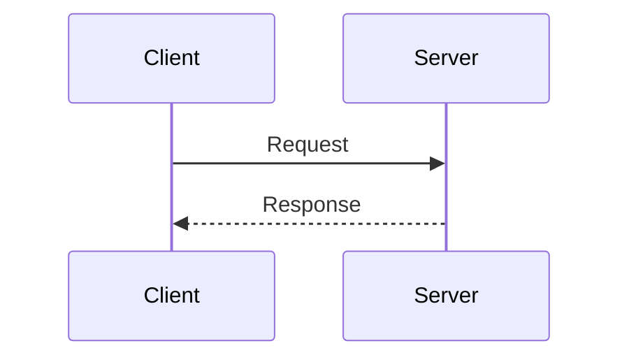
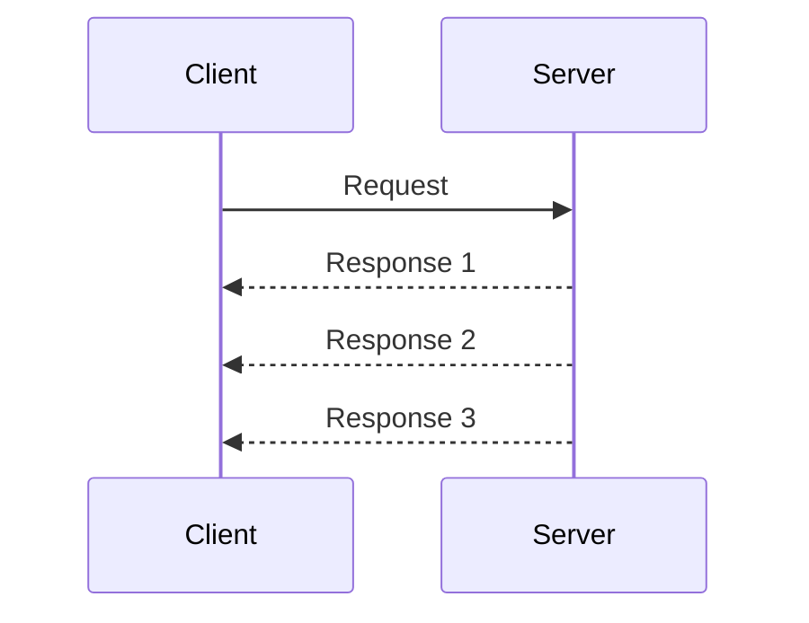
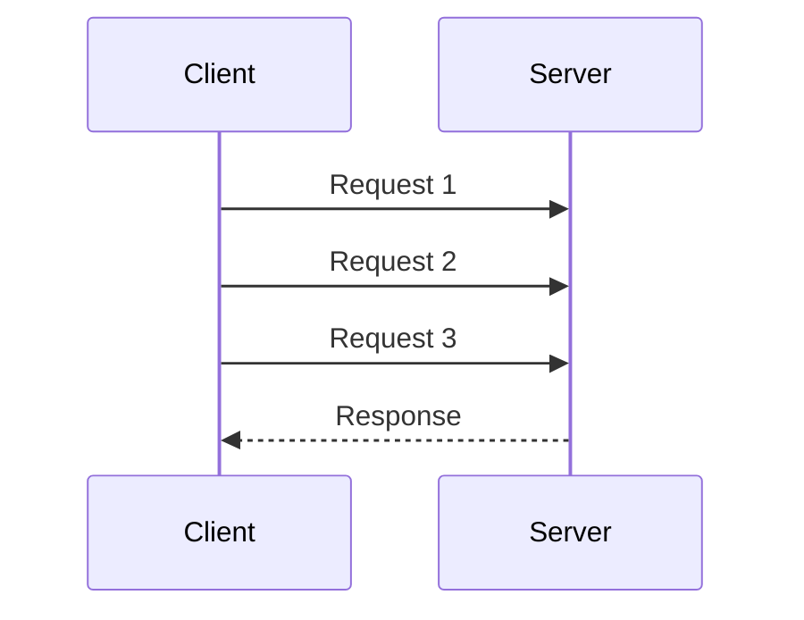
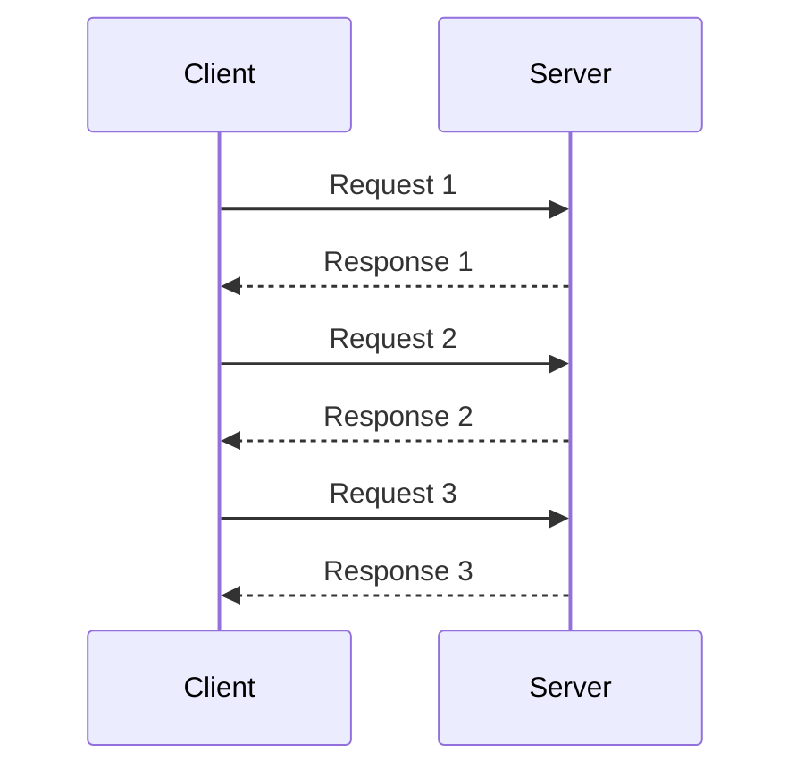

# What is gRPC (recursive acronym for gRPC Remote Procedure Calls)?

* High-performance alternative to REST APIs.

* **Remote Procedure Call** — call a function on another machine as if it were local.

  ```
  Client and Server have contract.

  Client                          Server
    |                               |
    |  sayHello("Alice")  ───────►  |
    |                               |  execute sayHello()
    |  ◄───────── "Hello, Alice!"   |
    |                               |
  ```

* Created by Google — open-sourced in 2015, 1.0 released in 2016, donated to [CNCF](https://en.wikipedia.org/wiki/Cloud_Native_Computing_Foundation) in 2017

* Supports 11 programming languages (C++, Java, Python, Go, C#, Ruby, Node.js, PHP, Dart, Kotlin, Rust)
  

---

# gRPC vs REST


| Aspect | REST API | gRPC |
|---------|------------|------|
| Protocol | Usually HTTP/1.1 | HTTP/2 (Multiplexing allows streaming) |
| Format | JSON (text) | Binary format (Protobuf) |
| Performance | Good | Good+ (HTTP/2 + Protobuf) |
| Human readable | ✅  Yes | ❌ Binary |
| Streaming | Server-Sent Events (SSE), WebSocket, Long Polling | [Native] Server, Client, Bidirectional |
| Contract + Code gen | Optional | Protobuf |
| Browser support | ✅ Native | ❌ Needs grpc-web proxy |

---

# gRPC vs REST performance benchmark with k6

[https://github.com/Ag0r9/k6-testing/](https://github.com/Ag0r9/k6-testing/)


If you want to see results with a better methodology https://kth.diva-portal.org/smash/get/diva2:1792957/FULLTEXT01.pdf

--- 


# When to Use gRPC


### ✅ Good fit

- Microservice-to-microservice communication.
- Real-time bidirectional streaming (chat, IoT, gaming).
- Polyglot environments, for example: Python, Go, Rust.
- High-throughput, low-latency APIs.
- Compact binary payloads for bandwidth-sensitive applications.
- Used by Google, Netflix, Square, Cisco, CockroachDB...

### ❌ Not the best fit

- Public APIs consumed by browsers directly.
- Simple scripts, one-off tools, or CRUD applications that make only occasional calls.
- Teams unfamiliar with Protobuf.
- Debugging / human inspection of traffic.


A common rule of thumb: Use REST API at the edge, gRPC inside.

---

### Basics in gRPC 

Write a contract. Create .proto file use Protobuf.

Generate client and server stubs code with grpc_tools.protoc.

Implement server and call it from client.


---

# Communication Patterns

## Unary: Request - Response


## Server streaming


## Client Streaming



## Bidirectional Streaming



---

<details>
  <summary>LIVE CODING.</summary>Create new fresh project:

```bash
mkdir grpc_test
cd grpc_test
uv init
```

Create project and install the grpcio and grpcio-tools package:

```bash
uv add grpcio grpcio-tools
source .venv/bin/activate
```

Create a .proto file with your service definition and messages. For example, create a file named `contract.proto`:

```proto
syntax = "proto3";

message NameMessage {
  //  Field numbers (1, 2...) are binary tags,
  // not values — must stay
  // unique and never change once deployed
  //  (backward compatibility).
  string name = 1;
}

message ResultMessage {
  string hello = 1;
}

message RequestMessage {
  int32 number = 1;
}

message ResponseMessage {
  string status = 1;
  int32 number = 2;
}

service Hello {
  // def SendHello(RequestMessage: RequestMessage) -> Response Message:
  rpc SendHello(NameMessage) returns (ResultMessage);
  rpc Counting(RequestMessage) returns (stream ResponseMessage);
}
```

```bash
python -m grpc_tools.protoc -I . --python_out=. --grpc_python_out=. --pyi_out=. contract.proto
``` 

-I / --proto_path - basic catalog for imports in .proto files

--python_out - where to generate _pb2.py

--grpc_python_out - where to generate _pb2_grpc.py

--pyi_out - typing stubs (helps with autocompletion in IDE)

After running the command, you will get three files:

* contract_pb2.py — contains classes for messages defined in your .proto file

* contract_pb2_grpc.py — contains classes for gRPC service

* contract_pb2.pyi - type stubs 

In contract_pb2_grpc.py you will find:

* Stub — client class to use RPC 

* Servicer — base class for implementing logic of RPCs

* add_Servicer_to_server(...) — function for register servicer to server

```python
# server.py
from concurrent.futures import ThreadPoolExecutor
import time

from grpc import server
from contract_pb2 import RequestMessage, ResponseMessage, NameMessage, ResultMessage
from contract_pb2_grpc import HelloServicer, add_HelloServicer_to_server


class Check(HelloServicer):
    def SendHello(self, request: NameMessage, context) -> ResultMessage:
        message = f"Cześć {request.name}!"
        print(message)
        return ResultMessage(hello=message)

    def Counting(self, request: RequestMessage, context):
        for i in range(1, request.number + 1):
            now = time.strftime("%H:%M:%S")
            print(f"[server] {now} sending {i}")
            yield ResponseMessage(status=now, number=i)
            time.sleep(1)


server = server(ThreadPoolExecutor())
add_HelloServicer_to_server(Check(), server=server)
server.add_insecure_port("localhost:5051")


try:
    server.start()
    print("Server start working 💪")
    server.wait_for_termination()
finally:
    server.stop(grace=5)
```

start the server:

```bash
uv run server.py
``` 

client.py

```python
# client.py
import time

from grpc import insecure_channel

from contract_pb2 import NameMessage, RequestMessage
from contract_pb2_grpc import HelloStub

# Channel = the abstraction that governs all communication to a given server (or set of servers).
# load balancing, connection state, credentials, keep-alive deadlines, transport security

with insecure_channel("localhost:5051") as channel:
    stub = HelloStub(channel)

    for _ in range(5):
        response = stub.SendHello(NameMessage(name="Kamil"))
        print(response)

    for response in stub.Counting(RequestMessage(number=8)):
        print(f"[client] {time.strftime('%H:%M:%S')} get: {response}")

```

Run client:

```bash
uv run client.py 

```

You will see the response from the server:

``` bash
hello: "Cześć Kamil!"

hello: "Cześć Kamil!"

hello: "Cześć Kamil!"

hello: "Cześć Kamil!"

hello: "Cześć Kamil!"

[client] 07:40:07 get: status: "07:40:07"
number: 1

[client] 07:40:08 get: status: "07:40:08"
number: 2

[client] 07:40:09 get: status: "07:40:09"
number: 3

[client] 07:40:10 get: status: "07:40:10"
number: 4

[client] 07:40:11 get: status: "07:40:11"
number: 5

[client] 07:40:12 get: status: "07:40:12"
number: 6

[client] 07:40:13 get: status: "07:40:13"
number: 7

[client] 07:40:14 get: status: "07:40:14"
number: 8

```

in server console you will see:

``` bash
Server start working 💪
Cześć Kamil!
Cześć Kamil!
Cześć Kamil!
Cześć Kamil!
Cześć Kamil!
[server] 07:40:07 sending 1
[server] 07:40:08 sending 2
[server] 07:40:09 sending 3
[server] 07:40:10 sending 4
[server] 07:40:11 sending 5
[server] 07:40:12 sending 6
[server] 07:40:13 sending 7
[server] 07:40:14 sending 8
```


</details>

