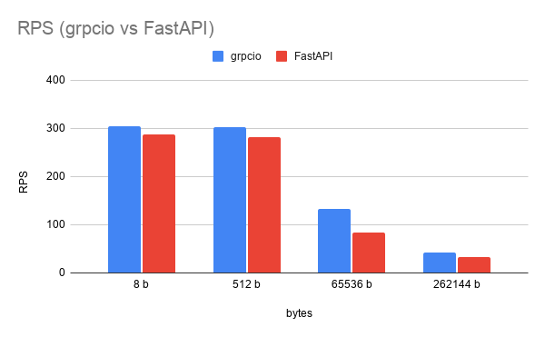
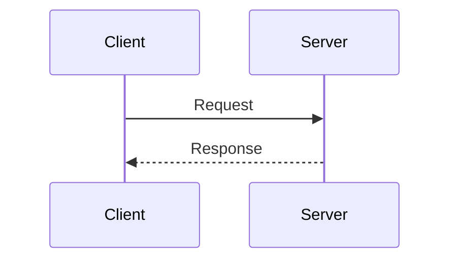
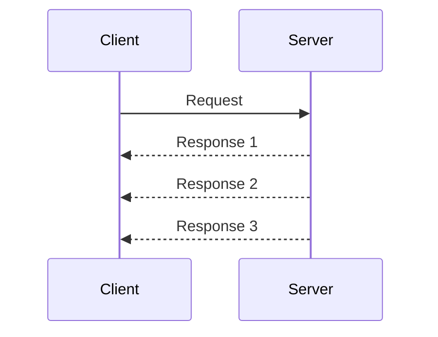
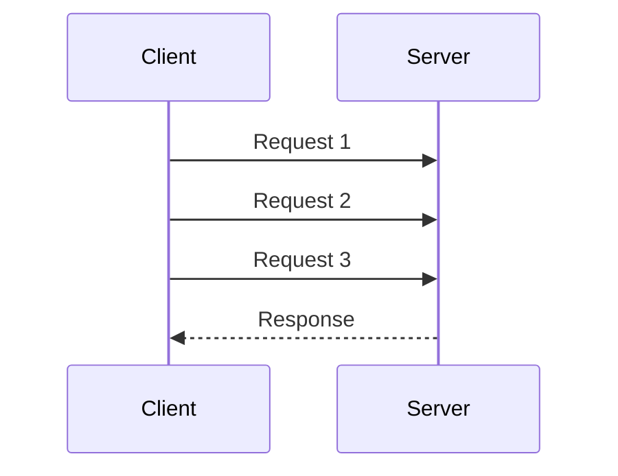
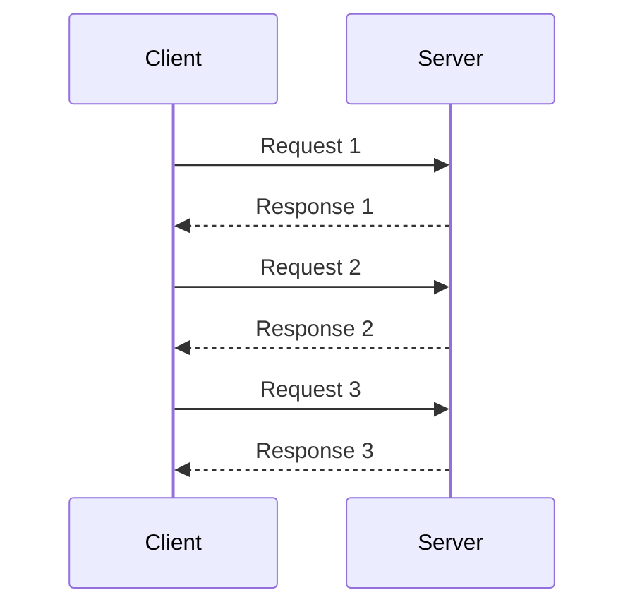

# What is gRPC (recursive acronym for gRPC Remote Procedure Calls)?

* High-performance alternative to REST APIs.

* **Remote Procedure Call** — call a function on another machine as if it were local.

  ```
  Client and Server have contract.

  Client                          Server
    |                               |
    |  sayHello("Alice")  ───────►  |
    |                               |  execute sayHello()
    |  ◄───────── "Hello, Alice!"   |
    |                               |
  ```

* Created by Google — open-sourced in 2015, 1.0 released in 2016, donated to [CNCF](https://en.wikipedia.org/wiki/Cloud_Native_Computing_Foundation) in 2017

* Supports 11 programming languages (C++, Java, Python, Go, C#, Ruby, Node.js, PHP, Dart, Kotlin, Rust)
  

---

# gRPC vs REST


| Aspect | REST API | gRPC |
|---------|------------|------|
| Protocol | Usually HTTP/1.1 | HTTP/2 (Multiplexing allows streaming) |
| Format | JSON (text) | Binary format (Protobuf) |
| Performance | Good | Good+ (HTTP/2 + Protobuf) |
| Human readable | ✅  Yes | ❌ Binary |
| Streaming | Server-Sent Events (SSE), WebSocket, Long Polling | [Native] Server, Client, Bidirectional |
| Contract + Code gen | Optional | Protobuf |
| Browser support | ✅ Native | ❌ Needs grpc-web proxy |

---

# gRPC vs REST performance benchmark with k6

[https://github.com/Ag0r9/k6-testing/](https://github.com/Ag0r9/k6-testing/)



If you want to see results with a better methodology https://kth.diva-portal.org/smash/get/diva2:1792957/FULLTEXT01.pdf

--- 


# When to Use gRPC


### ✅ Good fit

- Microservice-to-microservice communication.
- Real-time bidirectional streaming (chat, IoT, gaming).
- Polyglot environments, for example: Python, Go, Rust.
- High-throughput, low-latency APIs.
- Compact binary payloads for bandwidth-sensitive applications.
- Used by Google, Netflix, Square, Cisco, CockroachDB...

### ❌ Not the best fit

- Public APIs consumed by browsers directly.
- Simple scripts, one-off tools, or CRUD applications that make only occasional calls.
- Teams unfamiliar with Protobuf.
- Debugging / human inspection of traffic.


A common rule of thumb: Use REST API at the edge, gRPC inside.

---

### Basics in gRPC 

Write a contract. Create .proto file use Protobuf.

Generate client and server stubs code with grpc_tools.protoc.

Implement server and call it from client.


---

# Communication Patterns

## Unary: Request - Response


## Server streaming


## Client Streaming



## Bidirectional Streaming



---

<details>
  <summary>LIVE CODING.</summary>
Create new fresh project:

```bash
mkdir grpc_test
uv init
```

Create project and install the grpcio and grpcio-tools package:

```bash
source .venv/bin/activate

uv add grpcio grpcio-tools
```

Create a .proto file with your service definition and messages. For example, create a file named `contract.proto`:

```proto

syntax = "proto3";

message Request {
  string context = 1;
  int32 number = 2;
}

message Response {
  string status = 1;
  int32 number = 2;
}

service Hello {
  // def SendHello(RequestMessage: RequestMessage) -> Response Message:
  rpc SendHello(Request) returns (Response);

}
```

```bash
python -m grpc_tools.protoc -I . --python_out=. --grpc_python_out=. --pyi_out=. --include_imports contract.proto
``` 

-I / --proto_path - basic catalog for imports in .proto files

--python_out - where to generate _pb2.py

--grpc_python_out - where to generate _pb2_grpc.py

--pyi_out - typing stubs (helps with autocompletion in IDE)

--include_imports - useful for generating descriptor sets for reflection

After running the command, you will get two files:

* _pb2.py — contains classes for messages defined in your .proto file

* _pb2_grpc.py — contains classes for gRPC service

In _pb2_grpc.py you will find:

* Stub — client class to use RPC 

* Servicer — base class for implementing logic of RPCs

* add_Servicer_to_server(...) — function for register servicer to server

```python
# server.py

from concurrent.futures import ThreadPoolExecutor

from grpc import server
from contract_pb2 import Request, Response
from contract_pb2_grpc import HelloServicer, add_HelloServicer_to_server


class Check(HelloServicer):
    def SendHello(self, request: Request, context) -> Response:
        print(f"Request from client: {request.context}")
        return Response(status=f"{request.context} Hello!!!!")

server = server(ThreadPoolExecutor())
add_HelloServicer_to_server(servicer=Check(), server=server)
server.add_insecure_port("localhost:5051")
server.start()
print("Server start working 💪")
server.wait_for_termination()
```

start the server:

```bash
uv run server.py
``` 

client.py

```python
# client.py


import time

from grpc import insecure_channel

from contract_pb2 import Request
from contract_pb2_grpc import HelloServiceStub


with insecure_channel("localhost:5051") as channel:
    stub = HelloServiceStub(channel)

    response = stub.SendHello(Request(context="hi"))
    print(response)
```

run client:

```bash
uv run client.py 

```

you will see the response from the server:

``` bash
status: "hi Hello!!!!"
```

in server console you will see:

``` bash
Request from client: hi
```


</details>


<!--
10x / 3x — these are typical figures from Google's own benchmarks and community benchmarks
(e.g. github.com/thekvs/cpp-serializers). The actual gain depends on message structure:
flat, numeric-heavy messages compress more than deeply nested string-heavy ones.
Tell participants: "treat these as order-of-magnitude, benchmark your own workload."

Deadlines & cancellation:
- REST: if the client disconnects, the server keeps running (no built-in signal).
- gRPC: the client can attach a deadline (e.g. 500 ms). If the server hasn't finished
  by then, the call is cancelled on both sides automatically. context.is_active()
  returns False so you can stop early and free resources.
  This matters a lot for streaming — you don't leak open streams when clients drop.
-->


---