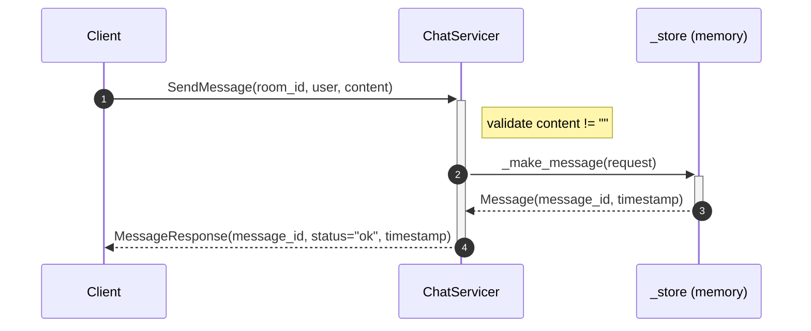
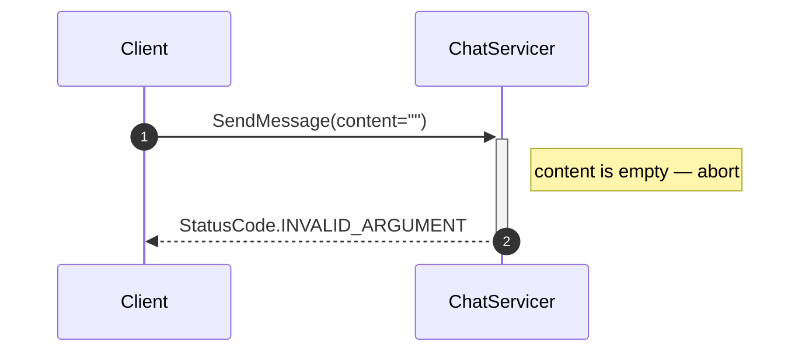

# Exercise 3: Implement Unary SendMessage

## Goal

Add real logic to `SendMessage` so the server actually stores and acknowledges
messages.

The helper `_make_message(request)` both stores the new message in memory and
returns the saved `Message` object, so you can reuse its generated
`message_id` and `timestamp` in the response.

## Context

A **unary RPC** works like a normal function call: one request in, one response
out. The servicer method receives:
- `request` — the `MessageRequest` proto object (fields: `room_id`, `user`, `content`)
- `context` — lets you set error codes, deadlines, metadata

## Message flow

**Happy path** — valid message stored and acknowledged:



**Error path** — empty content rejected before any persistence:



## Your task

Open `exercises/server.py` and implement `SendMessage` inside the
`ChatServicer` class:

1. **Validate first** — if `request.content` is empty, abort before any
   persistence happens:
    ```python
    context.abort(StatusCode.INVALID_ARGUMENT, "Message content cannot be empty")
    ```
2. **Save** — call `_make_message(request)`; it stores the message and
   returns a `Message` proto with `message_id` and `timestamp` already set
3. **Return** — a `MessageResponse`:
   ```python
   return chat_pb2.MessageResponse(
       message_id=msg.message_id,
       status="ok",
       timestamp=msg.timestamp,
   )
   ```

## Run it

```bash
# Terminal 1
poe server
# gRPC server listening on :50051

# Terminal 2 — quick smoke test with the CLI
poe client-send --room general --user alice "Hello!"
# ✓ Sent  id=<uuid>  status=ok
```

## ✅ Micro-check

Terminal 2 should print something like:

```
✓ Sent  id=3f2a1c7e-…  status=ok
```

Then try the failure path — an empty message should be rejected:

```bash
poe client-send --room general --user alice ""
# ✗ StatusCode.INVALID_ARGUMENT: Message content cannot be empty
```

If you get `UNIMPLEMENTED` instead of `INVALID_ARGUMENT`, `SendMessage` is
still returning `pass` — make sure the method is uncommented in `server.py`.

## Solution

`solutions/03_unary_service/server.py`
