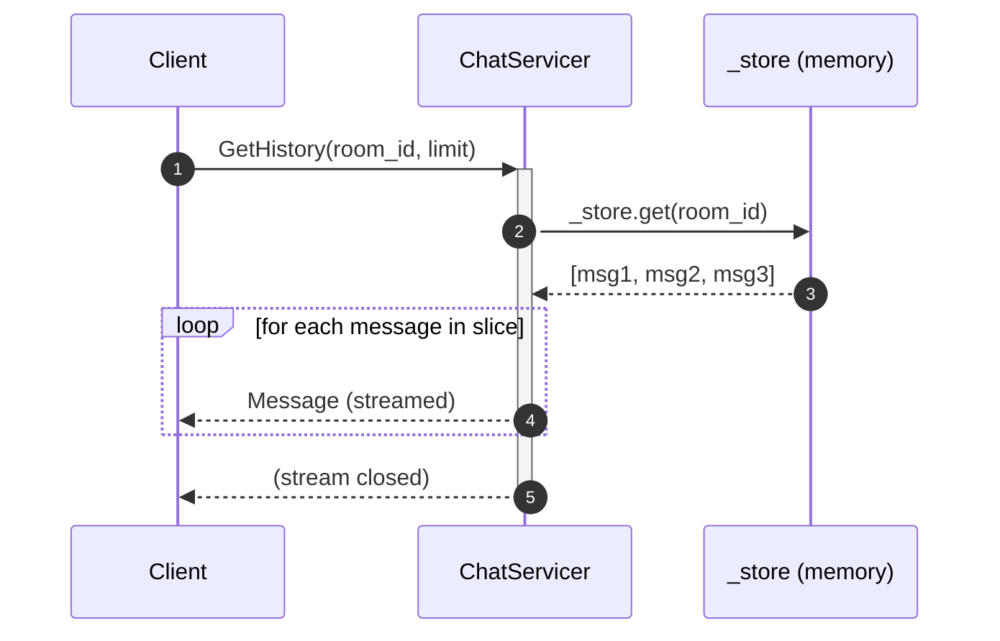
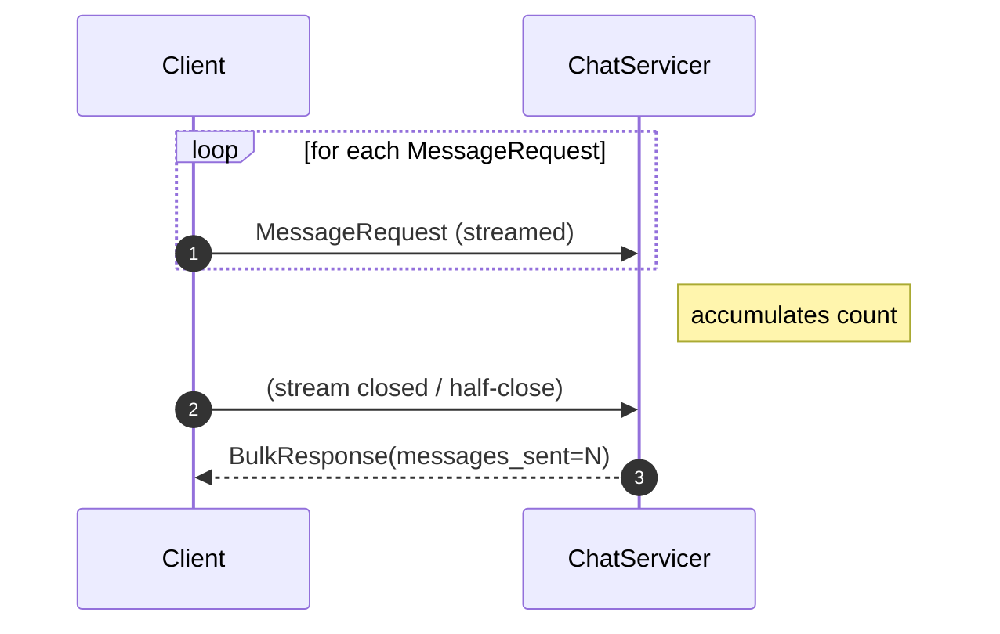
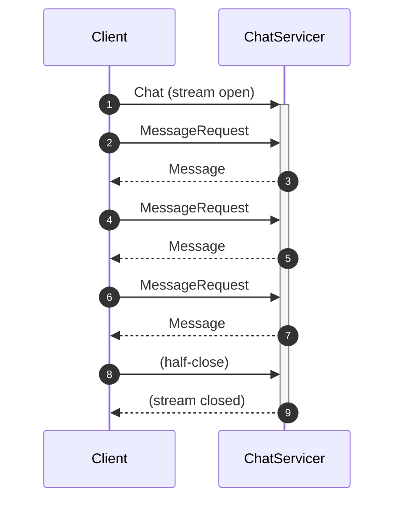

# Exercise 5: Streaming Patterns 

## Goal

Extend the server with all four communication patterns and test each one from the client.

This exercise has two required parts and one bonus part:
- **Required:** server streaming and client streaming
- **Bonus:** bidirectional streaming (`Chat`)

## Prerequisites

Have your server running (`poe server`) so you can test the client side
independently while you iterate on the servicer methods below.

## Message flows

**Server streaming — `GetHistory`** (one request, many responses):



**Client streaming — `SendBulkMessages`** (many requests, one response):



**Bidirectional — `Chat`** (bonus — many requests, many responses interleaved):



## Required Tasks

### Task 1 — Server streaming: `GetHistory`

In `exercises/server.py`, inside `ChatServicer`, implement
`GetHistory(self, request, context)`:

```python
def GetHistory(self, request, context):
    messages = _store.get(request.room_id, [])
    limit = request.limit if request.limit > 0 else len(messages)
    for msg in messages[-limit:]:
        yield msg   # ← key: just yield, gRPC handles the stream
```

Client side — iterate the result like a generator:

```python
for message in stub.GetHistory(
    chat_pb2.HistoryRequest(room_id="general", limit=10)
):
    print(f"[{message.user}] {message.content}")
```

### Task 2 — Client streaming: `SendBulkMessages`

```python
def SendBulkMessages(self, request_iterator, context):
    sent = 0
    for request in request_iterator:   # ← iterate the stream
        _store.setdefault(request.room_id, []).append(...)
        sent += 1
    return chat_pb2.BulkResponse(messages_sent=sent, messages_failed=0)
```

Client side — pass a **generator** as the argument:

```python
def messages():
    for i in range(10):
        yield chat_pb2.MessageRequest(room_id="general", user="alice", content=f"bulk {i}")

response = stub.SendBulkMessages(messages())
print(f"Sent: {response.messages_sent}")
```

## Bonus Task

### Bidirectional streaming: `Chat`

This is optional if you’re short on time. Try it after the required tasks are
working.

```python
def Chat(self, request_iterator, context):
    for request in request_iterator:
        msg = _save(request)
        yield msg   # echo the saved message back
```

## Test it

```bash
# Start server
poe server

# First send a couple of messages so history is non-empty
poe client-send --room general --user alice "first"
poe client-send --room general --user alice "second"

# Server streaming — get history
poe client-history --room general --limit 5

# Bidirectional chat (interactive)
poe client-chat --room general --user alice
```

Open `streaming_starter.py` to write your experiments.

## ✅ Micro-check

**Task 1 (GetHistory)** — after sending a few messages, history should stream
each one back:

```
[alice] first
[alice] second
```

If it prints nothing, the room name in `HistoryRequest` doesn't match the one
you sent to — double-check `room_id`.
If you get `UNIMPLEMENTED`, `GetHistory` is still `pass` in `server.py`.

**Task 2 (SendBulkMessages)** — `poe starter-05` should print:

```
Sent: 5   (or however many your generator yields)
```

If `messages_sent` is 0, the `for request in request_iterator` loop isn't
reached — make sure you're passing the generator object, not calling it
(`messages()` not `messages`).

**Bonus (Chat)** — `poe client-chat` should echo each typed line back with a
`←` prefix. If nothing comes back, `Chat` isn't yielding — check that you
call `_make_message` and `yield` the result.

## Solution

`solutions/05_streaming/streaming.py`
