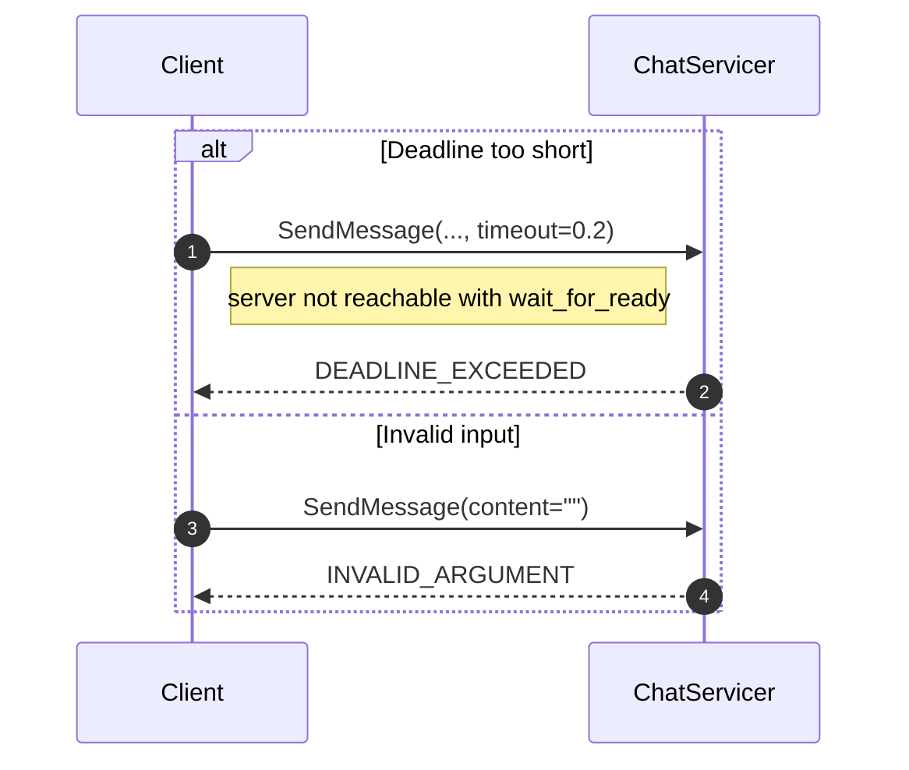

# Exercise 6: Deadlines and Error Handling 

## Goal

Learn how to make gRPC clients more resilient by handling:
- **Deadlines** (`DEADLINE_EXCEEDED`)
- **Status-based errors** (for example `INVALID_ARGUMENT`)

## Context

In real systems, RPCs can fail for many reasons:
- server is slow or unavailable
- caller gives invalid input

Your client should classify failures by **status code** and react cleanly.

## Message flow



## Your task

Open `deadlines_starter.py` and fill in TODOs:

1. **Deadline demo** — call an unreachable target with `wait_for_ready=True` and a short timeout, then catch and print `DEADLINE_EXCEEDED`.
2. **Error handling demo** — call `SendMessage` with empty content and catch `INVALID_ARGUMENT` with details.

## Run it

```bash
# Terminal 1
poe server

# Terminal 2
poe starter-06
```

## ✅ Micro-check

You should see output similar to:

```text
[Deadline] code=DEADLINE_EXCEEDED
[Error] code=INVALID_ARGUMENT details=Message content cannot be empty
```

If deadline shows `UNAVAILABLE`, check that your call uses `wait_for_ready=True`.

## Solution

`solutions/06_deadlines_cancellation_errors/deadlines_demo.py`
