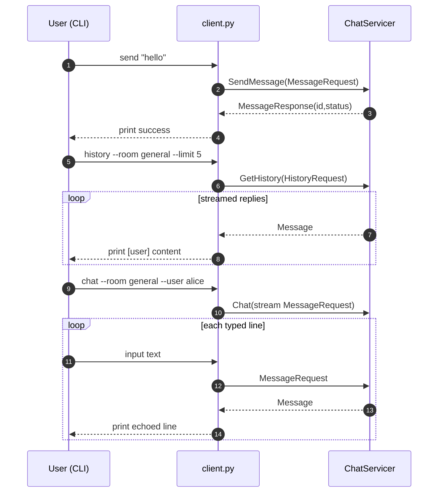

# Exercise 7: Final Chat Client in `client.py` 

## Goal

Build the final workshop app by implementing three CLI commands directly in
`exercises/07_final_chat_client/client.py`:

- `send` (unary)
- `history` (server streaming)
- `chat` (bidirectional streaming)

This exercise combines:

- **Exercise 05** knowledge (streaming loops + generators)
- **Exercise 06** knowledge (status-aware error handling, clean cancellation)

## Context

At this stage, the server already supports all required RPCs.
Your job is to make the **client CLI complete and resilient**.

## Message flow



## Your task

Open `exercises/07_final_chat_client/client.py` and implement these command functions:

1. `send(...)`
   - build `MessageRequest`
   - call `stub.SendMessage(...)`
   - print `message_id` and `status`
   - catch `grpc.RpcError` and print `code/details`

2. `history(...)`
   - call `stub.GetHistory(HistoryRequest(...))`
   - iterate the stream and print each message
   - handle `grpc.RpcError`

3. `chat(...)`
   - create a request generator reading from `input()`
   - send stream to `stub.Chat(...)`
   - print incoming streamed replies
   - stop cleanly on `KeyboardInterrupt` / `EOFError`
   - ignore/quietly handle `StatusCode.CANCELLED`

## Run it

Copy client.py from workshop/exercises/07_final_chat_client/ to workshop/exercises/

```bash
# Terminal 1
poe server

# Terminal 2
poe client-send --room general --user alice "Hello from Exercise 7"
poe client-history --room general --limit 5
poe client-chat --room general --user alice
```

## ✅ Micro-check

You should see:

```text
✓ Sent  id=<uuid>  status=ok
[alice] Hello from Exercise 7
  ← [alice] <your typed line>
```

If `send` fails with `INVALID_ARGUMENT`, your content is empty.
If `history` prints nothing, check room names.
If `chat` never prints replies, verify you are iterating `stub.Chat(...)`.

## Solution

`solutions/client.py`
